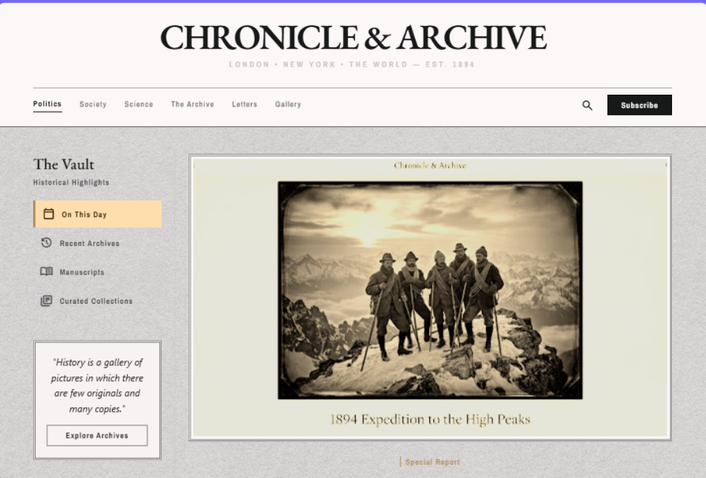

# Chronicle & Archive

> A vintage newspaper-style historical blog website with AI-powered content generation.



## Overview

**Chronicle & Archive** is a single-page editorial blog website that evokes the aesthetic of late 19th-century print journalism while maintaining modern web standards. The site features AI-powered blog post generation using LangChain.js with OpenRouter, allowing users to create historically-themed content with a single click.

## Features

- **AI Blog Generation** — LangChain.js + OpenRouter LLM integration for generating historical blog posts
- **Vintage Newspaper Design** — Sepia-toned, typography-first layout inspired by 1894 print journalism
- **6 Category Pages** — Politics, Society, Science, The Archive, Letters, Gallery
- **Post Creation Popup** — Side panel form with Zod validation for creating AI-generated posts
- **GSAP Scroll Animations** — Subtle reveal animations on scroll
- **TanStack Query** — Data fetching, caching, and automatic refresh
- **Zustand State Management** — Lightweight global state for posts and UI
- **Responsive Design** — Desktop, tablet, and mobile layouts
- **Pre-loaded Historical Posts** — 6 curated posts across Politics, Society, and Science

## Tech Stack

| Technology | Purpose |
|-----------|---------|
| React 19 | Frontend framework |
| TypeScript | Type safety |
| Vite 8 | Build tool |
| Tailwind CSS 4 | Styling |
| LangChain.js + OpenRouter | AI content generation |
| TanStack Query | Data fetching & caching |
| Zustand | State management |
| Zod | Form validation |
| GSAP | Scroll animations |
| React Router | Client-side routing |
| React Markdown | Markdown rendering |
| Lucide React | Icons |

## Project Structure

```
blogagent/
├── public/                  # Static assets
├── src/
│   ├── components/          # Reusable UI components
│   │   ├── Header.tsx       # Navigation bar with logo
│   │   ├── Footer.tsx       # Three-column footer
│   │   ├── TheVault.tsx     # Sidebar with vault navigation
│   │   ├── FeaturedPost.tsx # Hero featured image card
│   │   ├── ArticleCard.tsx  # Individual article card
│   │   ├── ArticleGrid.tsx  # Multi-column article layout
│   │   ├── PullQuote.tsx    # Full-width blockquote
│   │   └── PostForm.tsx     # AI post creation popup
│   ├── pages/               # Route pages
│   │   ├── HomePage.tsx     # Main landing page
│   │   ├── CategoryPage.tsx # Reusable category template
│   │   ├── CategoryPages.tsx# All 6 category page exports
│   │   └── PostDetailPage.tsx# Individual post view
│   ├── store/
│   │   └── usePostStore.ts  # Zustand store
│   ├── hooks/
│   │   ├── usePosts.ts      # TanStack Query hooks
│   │   └── useGsapReveal.ts # GSAP scroll animation hook
│   ├── lib/
│   │   ├── ai.ts            # LangChain + OpenRouter service
│   │   ├── validation.ts    # Zod schemas
│   │   └── posts/           # Pre-loaded post data
│   │       ├── politics.ts
│   │       ├── science.ts
│   │       └── society.ts
│   ├── types/
│   │   └── index.ts         # TypeScript interfaces
│   ├── App.tsx              # Root with Router + Query Provider
│   ├── main.tsx             # Entry point
│   └── index.css            # Tailwind + custom styles
├── Posts/                   # Raw post content + images
│   ├── PoliticsPost/
│   ├── SciencePost/
│   └── SocietyPost/
├── Context/                 # Design & agent specifications
│   ├── agent-skills.md
│   ├── system-prompt.md
│   └── exact-design-and-develop-prompt.md
├── UIDesign/                # Design mockups
├── logs/                    # Error logs
├── .env                     # OpenRouter API key
└── package.json
```

## Getting Started

### Prerequisites

- Node.js 18+
- npm or yarn
- OpenRouter API key

### Installation

```bash
cd blogagent
npm install
```

### Environment Variables

Create a `.env` file in the project root:

```env
VITE_OPENROUTER_API_KEY=your_openrouter_api_key_here
VITE_OPENROUTER_MODEL=google/gemma-4-31b-it:free
```

### Development

```bash
npm run dev
```

### Build

```bash
npm run build
```

### Preview

```bash
npm run preview
```

## AI Integration

The AI feature uses **LangChain.js** with the **OpenRouter** provider to generate historical blog posts. When a user fills out the post creation form:

1. Input is validated using **Zod** schemas
2. The content is sent to the LLM via LangChain's `ChatOpenRouter`
3. The system prompt instructs the LLM to generate clean Markdown with proper structure
4. The generated post is added to the Zustand store
5. TanStack Query invalidates and refreshes the post list

### System Prompt Skills

The AI agent applies these skills to every generated post:

- Grammar, punctuation, and spelling correction
- Professional rewriting without changing meaning
- Readability improvements (paragraph splitting, flow)
- Meaningful section headings
- Important fact highlighting (bold for dates, figures, events)
- SEO metadata generation (title, description, slug, keywords, tags)
- Reading time estimation
- Historical accuracy preservation
- Clean Markdown formatting

## Design System

### Color Palette

| Token | Hex | Usage |
|-------|-----|-------|
| `paper-bg` | `#F5F3EE` | Main background |
| `ink-black` | `#1A1A1A` | Headings, primary text |
| `ink-gray` | `#4A4A4A` | Body text |
| `muted-gray` | `#8A8A8A` | Captions, subtitles |
| `accent-gold` | `#B8956A` | Tags, highlights |
| `sidebar-active` | `#F0E6D3` | Active sidebar item |
| `border-gray` | `#C4C4C4` | Borders, dividers |

### Typography

- **Headings:** Playfair Display (48px logo, 42px article titles)
- **Body:** EB Garamond (16px, 1.7 line-height)
- **Quotes:** Libre Baskerville (italic)

### Design Rules

- No rounded corners (sharp, print-like edges)
- No modern shadows (borders and spacing for hierarchy)
- Sepia treatment on all photographic content
- Generous whitespace throughout
- Subtle paper grain texture overlay

## Routes

| Path | Description |
|------|-------------|
| `/` | Home page with The Vault sidebar and article grid |
| `/politics` | Political history articles |
| `/society` | Social movements and cultural stories |
| `/science` | Scientific mysteries and discoveries |
| `/archive` | Complete article collection |
| `/letters` | Scholarly correspondence |
| `/gallery` | Visual archives |
| `/post/:id` | Individual post detail view |

## License

This project is for educational and demonstration purposes.
